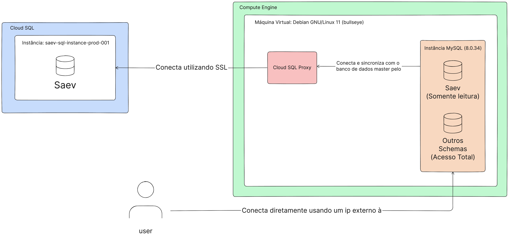

# 🗄️ Réplica do Banco de Dados 

O propósito central da configuração da réplica do banco de dados é aliviar a carga sobre a instância principal e fornecer uma plataforma para desenvolver novas views e esquemas voltados para a análise de dados.

## 🛠️ Detalhes Técnicos

A instalação da réplica foi efetuada em uma máquina virtual que opera sob o sistema **Debian GNU/Linux 11 (bullseye)**. Ela roda uma instância do banco de dados **MySQL (8.0.34)**, configurada especificamente para replicar apenas o Schema "Saev".

A réplica mantém uma conexão contínua com a instância master, utilizando para isso o **Cloud SQL Proxy**. Esta ferramenta estabelece um túnel de conexão, garantindo a segurança da transmissão dos dados através do protocolo SSL para a instância do Cloud SQL. Para acessar a réplica, os usuários podem se conectar de forma direta por meio de um IP externo.

O dados são replicados utilizando GTIDs e são constantemente atualizados para se manterem idênticos ao Schema original, quase em tempo real.

### 📜 Configuração do MySQL

A seguir, a configuração detalhada adotada no arquivo `my.cnf` do MySQL:

```bash
[mysqld]
server-id=1
gtid_mode=ON
enforce_gtid_consistency=ON
log_slave_updates=ON
replicate-do-db=Saev
binlog-format=ROW
log_bin=mysql-bin
expire_logs_days=1
read_only=OFF
partial_revokes=ON
```

## 🌍 Especificações da Máquina

- **Zona**: southamerica-east1-c
- **Tipo da Máquina**: n1-standard-1 (1vCPU, 3.75 GB RAM)
- **Armazenamento**: 100GB SSD

## 🔍 Informações Adicionais

- **Monitoramento**: Configurações de alertas para CPU, memória e uso de disco são transmitidos diretamente para o Slack 💬.
- **Backup**: São realizados snapshots diários da réplica, mantidos por um período de 14 dias 📸.
- **Acessibilidade**: O usuário da réplica possui permissões totais em todos os Schemas, com exceção do **Sys** e **Saev** 🚫. No Schema **Saev**, o acesso é restrito à leitura.

## 📜 Procedimentos de Configuração

### Configuração da Réplica

```sql
CHANGE MASTER TO MASTER_HOST='127.0.0.1', MASTER_USER='replication', MASTER_PORT=3307, MASTER_PASSWORD='****', MASTER_AUTO_POSITION=1;
```

### Restrições e Permissões

Ajustes no Schema e definição de permissões para os usuários:

```sql
ALTER DATABASE Saev READ ONLY = 1;
GRANT SELECT, INSERT, UPDATE, DELETE, CREATE, DROP, INDEX, ALTER, CREATE TEMPORARY TABLES, LOCK TABLES, EXECUTE, CREATE VIEW, SHOW VIEW, CREATE ROUTINE, ALTER ROUTINE, EVENT, TRIGGER ON *.* TO `external`@`%`;
REVOKE INSERT, UPDATE, DELETE, CREATE, DROP, INDEX, ALTER, CREATE TEMPORARY TABLES, LOCK TABLES, EXECUTE, CREATE VIEW, SHOW VIEW, CREATE ROUTINE, ALTER ROUTINE, EVENT, TRIGGER ON Saev.* FROM `external`@`%`;
REVOKE SELECT, INSERT, UPDATE, DELETE, CREATE, DROP, INDEX, ALTER, CREATE TEMPORARY TABLES, LOCK TABLES, EXECUTE, CREATE VIEW, SHOW VIEW, CREATE ROUTINE, ALTER ROUTINE, EVENT, TRIGGER ON sys.* FROM `external`@`%`;
```

### Backup do Banco de Dados 

O comando a seguir executa um dump do banco de dados e carrega o arquivo resultante para o Google Cloud Storage:

```bash
mysqldump --host=127.0.0.1 \
--port=3307 \
--user=root \
--password="*******" \
--hex-blob \
--source-data \
--no-autocommit \
--default-character-set=utf8mb4 \
--single-transaction \
--all-databases --triggers --routines --events \
--set-gtid-purged=on | gsutil cp - "gs://<bucket>/<file>.sql"
```

## 🖼️ Diagrama de Arquitetura

Para uma visualização da estrutura, consulte o diagrama de arquitetura que acompanha esta documentação:


